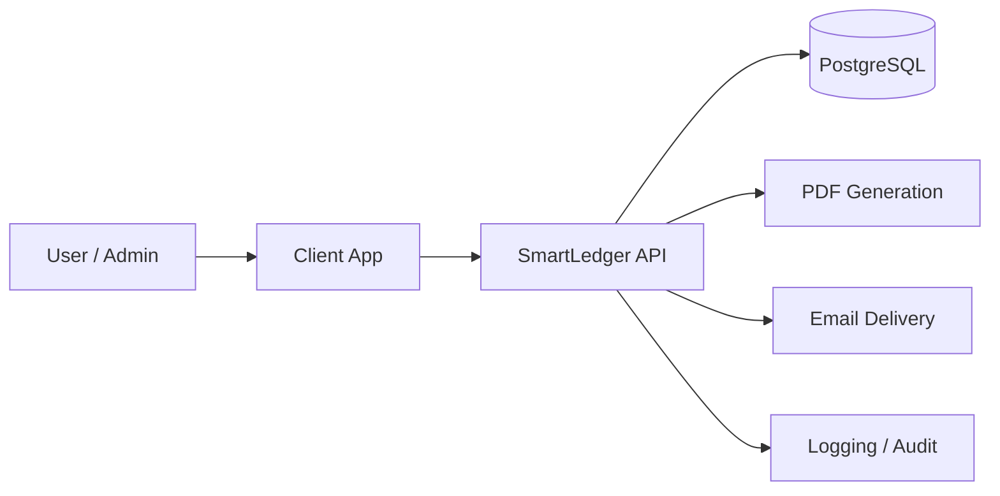

# SmartLedger

SmartLedger is a monorepo for an invoice-generation SaaS platform. The current workspace contains a production-oriented backend API in `server/` and a placeholder frontend workspace in `client/`.

## What SmartLedger Does

SmartLedger is designed to manage the full billing lifecycle for small businesses and service teams:

- Authenticate users with secure access and refresh tokens
- Create and manage businesses, customers, invoices, and receipts
- Generate PDF invoices and receipts
- Email invoices and receipts to customers
- Track payment status and invoice lifecycle events
- Provide dashboard analytics and audit logging

## Repository Layout

- `server/` - Express, TypeScript, TypeORM, PostgreSQL backend with auth, invoicing, receipts, PDF generation, email delivery, and security middleware
- `client/` - Reserved for the web frontend
- `README.md` - Project-level overview and onboarding guide

## High-Level Architecture



The backend exposes the main API under `/api/v1` and serves interactive API documentation at `/api-docs`.

## Technology Stack

### Backend

- Node.js
- Express
- TypeScript
- PostgreSQL
- TypeORM
- JWT authentication
- argon2 password hashing
- Joi validation
- PDFKit for PDFs
- Postmark for email delivery
- Winston for structured logging
- Jest and Supertest for tests
- Docker for local development and deployment

### Frontend

- `client/` is currently empty and ready for the UI implementation.

## Production Features

The API includes production-focused capabilities such as:

- Security middleware for HTTP headers, CORS, rate limiting, sanitization, and request hardening
- Centralized error handling and structured logs
- JWT refresh-token rotation
- Business-level invoice and receipt workflows
- PDF and email export flows for invoice delivery

## Quick Start

### 1. Install dependencies

```bash
cd server
pnpm install
```

### 2. Configure environment variables

```bash
cp server/.env.example server/.env
```

Update the following values in `server/.env`:

- `DATABASE_URL`
- `JWT_ACCESS_SECRET`
- `JWT_REFRESH_SECRET`
- `CORS_ORIGIN`
- `APP_URL`
- `POSTMARK_SERVER_TOKEN` if you plan to send email

### 3. Start the database

```bash
cd server
docker compose up -d
```

### 4. Start the API

```bash
cd server
pnpm run dev
```

By default, the API listens on the port defined in `server/.env`.

## Common Server Scripts

From `server/`:

- `pnpm run dev` - Start the development server
- `pnpm run build` - Compile TypeScript into `dist/`
- `pnpm run start` - Run the compiled server
- `pnpm run test` - Run the automated test suite
- `pnpm run seed` - Load sample data
- `pnpm run dc:up` - Start the Docker Compose database service
- `pnpm run dc:down` - Stop Docker Compose services

## API Surface

The backend covers the main billing flow:

- Authentication and session refresh
- User profile access
- Business management
- Customer management
- Invoice creation, update, PDF generation, and sending
- Receipt creation, listing, PDF generation, and sending
- Analytics and reporting
- Audit logging

## Documentation

- API docs: `/api-docs`
- API base path: `/api/v1`
- Backend-specific setup and VAPT notes: [`server/README.md`](server/README.md)

## Quality and Security Checks

From `server/`, you can run:

```bash
pnpm audit --json
pnpm run build
pnpm run test
```

For deeper security validation, use:

- Trivy to scan the Docker image
- OWASP ZAP to scan the running API

## Deployment Guidance

- Use a real PostgreSQL instance in production.
- Manage secrets through a secrets manager instead of committing `.env` values.
- Put the API behind HTTPS and a reverse proxy or load balancer.
- Run migrations in production instead of relying on schema synchronization.
- Add the frontend application in `client/` when it is ready.

## Current Status

- Backend: implemented, tested, and ready for further hardening
- Client: not yet implemented
- Root workspace: serves as the top-level entry point for the monorepo

## Roadmap

1. Add the frontend application in `client/`
2. Introduce database migrations for production deployments
3. Add CI checks for build, tests, dependency audit, and container scanning
4. Add readiness/liveness probes for orchestration
5. Complete end-to-end testing for invoicing and receipt workflows
